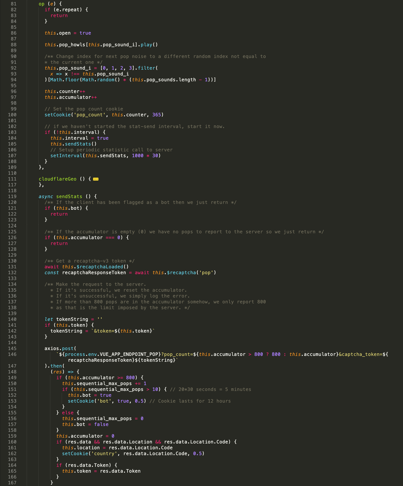
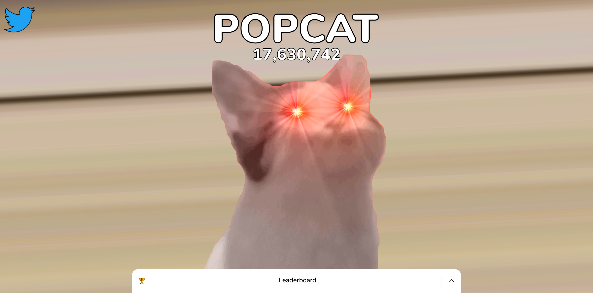
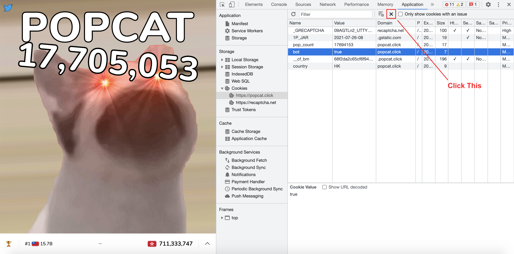

# Popcat Bot

This is a browser script to automatically send "Pops" (clicks) to [https://popcat.click](https://popcat.click). It sends 799 pops every 30 seconds.

## Getting Started

This script can be used in 2 ways:

### Running in browser's devtool (Manual)
1. Copy the content of `popcat-bot.user.js`
2. Switch to browser window, navigate to [https://popcat.click](https://popcat.click)
3. Press `Command + Option + I` (Mac) or `Control + Shift + I` (Windows, Linux) key to open devtool
4. Switch to "Console" tab in devtool
5. Paste the copied content devtool and press `Enter` to execute it

### Using Tampermonkey
1. Install [Tampermonkey](https://www.tampermonkey.net/) if not already installed
2. Open this [script link](https://raw.githubusercontent.com/icelam/popcat-bot/develop/popcat-bot.user.js) and click install. If Tampermonkey failed to detect the script as an userscript, install it manually:
    1. Open Tampermonkey's Dashboard in your browser
    2. Click the icon with a plus symbol to add a new script
    3. Paste the copied content to editor and save it
3. Refresh [https://popcat.click](https://popcat.click) browser tab
4. If the script is successfully installed, you should see the "Pops" counter increase every 30 seconds. You can also open devtools by pressing `Command + Option + I` (Mac) or `Control + Shift + I` (Windows, Linux) key to check if there is any console message indicating that bot has started.

## How it works?

#### Why is it 799 "Pops" every 30 seconds? Can I adjust the script to send more "Pops"?

It is not recommended to send "Pops" more then 799 every 30 seconds due to Popcat's logic.

Popcats sends accumlated clicks to it's server every 30 second. On every request being sent, it checks whether the accumlated clicks is `>= 800`, if it is `true`, then it will increase the value of a variable called `sequential_max_pops` by 1. When `sequential_max_pops` reaches 11, it will mark variable `bot` as true, and all clicks afterwards will not be send to server, which also means no contribution to the leaderboard.

Also, for accumlated clicks more than 800, the value will clamped to 800 before sending to server. So the maximum contribution to leaderboard per 30 seconds will be 800 only.

Here is the source code of Popcat as of 15 August, 2021.

#### How do I know I have been marked as bot? 

The cat will turn into red eye.

#### I have been detected as bot. What should I do?

No worries, this scripts automatically handles it for you. However, you can also perform the following steps manually:

1. Clear `bot` flag in cookie storage. This can be done via: 
    1. Press `Command + Option + I` (Mac) or `Control + Shift + I` (Windows, Linux) key to open devtool in browser
    2. Switch to "Application" tab
    3. Select "Cookies" in the left panel
    4. Select "https://popcat.click"
    5. Select "bot" row and click "Delete Selected" (Cross symbol icon)
        
2. Refresh the page
